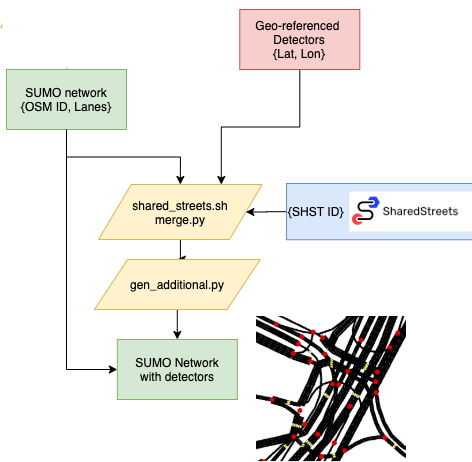

# sumo_network_detectors

<!-- Description -->
## Description
This repository contains a (hack) procedure to assign geo-referenced detectors on a SUMO network, and generate the detector input file.

We use [sharedstreets-js](https://github.com/sharedstreets/sharedstreets-js) map-matcher to join the point coordinates with the OSM edges. This is done by the ```shst match``` command with certain arguments in terminal:
```
shst match input_file --out=output_file
```
You can call ```shst match --help``` for complete list of arguments.

<!-- Layout -->
## Pipeline layout


## Files and sequence of execution
For running the files ```cd``` to the [src](src) folder

1. [shared_street.sh](src/shared_street.sh): The purpose of the shell file is automate some trivial stuff, so that we can experiment with different arguments quickly. First, we specify paths to NVM, because Node.js (tested with version 10) is used by [sharedstreets-js](https://github.com/sharedstreets/sharedstreets-js) tool. This has been only tested on OSX. Then we also specify the paths to input and output files corresponding to detector coordinates and OSM geometries. But these files can be replaced by any geo-objects if they are supported by [sharedstreets-js](https://github.com/sharedstreets/sharedstreets-js). You can also run the matching in terminal too. You can run this file in Ubuntu/ OSX using 
	```
	sh shared_streets.sh
	```

2. [merge.py](src/merge.py): Output of the first step generates two geojson files: one output for point coordinates, and other output for OSM edges. This python script merges two files using column ```shst_id```, and saves the merged output in csv format. You can change the paths to input and output files in this file.

3. [generate_additional.py](src/generate_additional.py): This file use the output csv file from the second step to generate the detector (additional) input for SUMO. Check other parameters in the script.

<!-- ACKNOWLEDGMENTS -->
## Acknowledgments

* [sharedstreets-js](https://github.com/sharedstreets/sharedstreets-js)
* [SUMO](https://github.com/eclipse/sumo)
